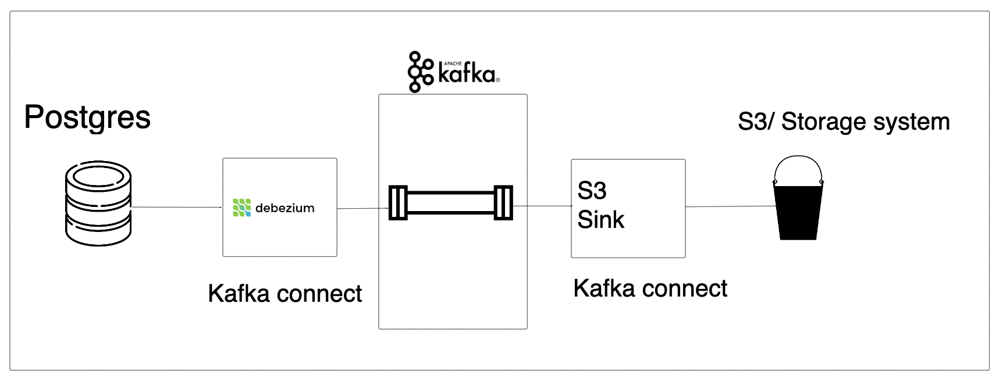

# Change Data Capture (CDC)
## What & Why CDC
CDC (Change Data Capture) refers to capturing all the changes to a dataset/table and making it available for downstream systems to do as required.
Example use cases:
1. Capture every change that occurred to your data, either for auditing, SCD2, etc., where you need to see every historical change.
2. Event-driven architecture, where a service operates in response to a change in data. E.g., a change in credit card number in a DB triggers an action in a separate microservice (say to check that the CC is valid, etc.).
3. Syncing data across different databases in near real-time. E.g., Postgres -> Elasticsearch to enable text search, Postgres -> Warehouse to enable analytics based on the most recent data.

## CDC, the EL of your data pipeline
When people talk about CDC in the context of data pipelines, they typically talk about two parts.
### Capturing changes from the source system (E)
A CDC system must be able to access every change to the data. The changes include creates, updates, deletes, and schema changes. There are three main ways a CDC system can extract data from a database; they are below.
1. **Log**: Our CDC system will read directly from a database’s transaction log in this method. A transaction log stores every change that happens in the database and is used in case of a crash in the database to restore to a stable state.
2. **Incremental**: In this method, our CDC system will use a column in the table to pull new rows.
3. **Snapshot**: Our CDC system will pull the entire data in this method.
### Making changes available to consumers (L)
Now that we have captured all the changes to the data, we will need to make it available to consumers. While we can use several frameworks, they usually fall into one of two patterns:
1. Extracting the change data and making it available via a shared location (e.g., S3, Kafka, etc.) for multiple downstream consumers.
2. Extracting and loading the change data directly into a destination system.

# Project
**Objective**:   Capture every change to the `commerce.products` and `commerce.users` table in a Postgres database and make it available for analytics. 

**Data pipeline**: 
1. Uses debezium to capture all the changes to the `commerce.products` and `commerce.users` table in a Postgres database.
2. Pushes the change data into a Kafka queue (one topic per table) for downstream consumers.
3. An S3 sink (downstream consumer) pulls data from the corresponding Kafka topic and loads it into an S3 bucket (with table-specific paths).

**Architecture**

The main components:
1. **Upstream System**: Postgres database, with user and product tables.
2. **Kafka Connect Cluster**: Kafka Connect enables data transfer between Kafka and various systems.
3. **Kafka Cluster**: To make our change data available for downstream consumers.
4. **Data Storage**: A cloud storage system to store the data generated by debezium. We use minio (S3 OS alternative).

## Command
**Kafka**
List topics
./kafka_2.13-3.4.0/bin/kafka-topics.sh --bootstrap-server 127.0.0.1:9093 --list

./kafka_2.13-3.4.0/bin/kafka-console-consumer.sh --bootstrap-server 127.0.0.1:9093 --topic debezium.commerce.products --from-beginning --max-messages 1

./kafka_2.13-3.4.0/bin/kafka-console-consumer.sh --bootstrap-server 127.0.0.1:9093 --topic debezium.commerce.users --from-beginning --max-messages 1

**Postgre**
connect to postgres

pgcli -h localhost -p 5432 -U postgres -d postgres

**Check for connectors**

curl -H "Accept:application/json" localhost:8083/connectors/
curl -H "Accept:application/json" "localhost:8083/connectors?expand=status"	| jq .

**Setup connectors**

curl -i -X POST -H "Accept:application/json" -H "Content-Type:application/json" localhost:8083/connectors/ -d '@./connectors/pg-src-connector.json'

curl -i -X POST -H "Accept:application/json" -H "Content-Type:application/json" localhost:8083/connectors/ -d '@./connectors/s3-sink.json'

1. postgres connector

curl -i -X POST -H "Accept:application/json" -H "Content-Type:application/json" localhost:8083/connectors/ -d '@./connectors/pg-src-connector.json'

check wal level
`select * from pg_settings where name ='wal_level';

docker compose down -v

2. S3 sink connector

curl -i -X POST -H "Accept:application/json" -H "Content-Type:application/json" localhost:8083/connectors/ -d '@./connectors/s3-sink-connector.json'

curl -i -X POST -H  "Content-Type:application/json" localhost:8083/connectors/s3-sink-connector/config -d '@./connectors/s3-sink-connector.json'

curl -i -X PUT -H  "Content-Type:application/json" localhost:8083/connectors/s3-sink-connector/config -d '@./connectors/s3-sink-connector.json'

curl -i -X PUT -H  "Content-Type:application/json" localhost:8083/connectors/ -d '@./connectors/s3-sink-connector-2.json'

curl -i -X POST -H "Accept:application/json" -H "Content-Type:application/json" localhost:8083/connectors/ -d '@./connectors/s3-sink.json'

curl -i -X POST -H "Accept:application/json" -H "Content-Type:application/json" localhost:8083/connectors/ -d '@./connectors/s3-sink-2.json'

# References

1. [Debezium postgre docs](https://debezium.io/documentation/reference/2.1/connectors/postgresql.html)
2. [Redpanda CDC example](https://redpanda.com/blog/redpanda-debezium)
3. [Kafka docs](https://kafka.apache.org/20/documentation.html)